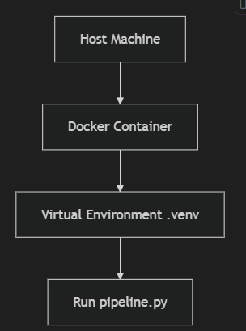

## Simple Workflow




Docker helps isolate software from the host machine.
We can use a container to run our project with its own Python and dependencies.

Why Docker?
Docker provides the following advantages:

Reproducibility: Same environment everywhere
Isolation: Applications run independently
Portability: Run anywhere Docker is installed
They are used in many situations:

Integration tests: CI/CD pipelines
Running pipelines on the cloud: AWS Batch, Kubernetes jobs
Spark: Analytics engine for large-scale data processing
Serverless: AWS Lambda, Google Functions

`venv` isolates Python packages for one project, but it still uses your machine's operating system.
Docker isolates the whole application environment, including OS-level setup, Python, dependencies, and code.


## 1. Create The Environment

A virtual environment keeps this project's Python packages separate from the global Python on the machine.

From the repo root:

```bash
cd /workspaces/data-engineering-zoomcamp/pipeline
python3 -m venv .venv
source .venv/bin/activate
```

## 2. Set The VS Code Interpreter

Open the Command Palette:

```text
Ctrl+Shift+P
```

Then choose:

```text
Python: Select Interpreter
```

Use this interpreter path:

```text
/workspaces/data-engineering-zoomcamp/pipeline/.venv/bin/python
```

## 3. Run The Python File Locally

From the `pipeline` folder:

```bash
source .venv/bin/activate
python pipeline.py 9
```

## 4. Dockerfile Used

The Docker image is built from `pipeline/Dockerfile`.

It does these things:

- starts from `python:3.13.11-slim`
- copies the `uv` binary into the image
- copies `pyproject.toml`, `.python-version`, and `uv.lock`
- runs `uv sync --locked`
- copies `pipeline.py`
- starts with `python pipeline.py`

## 5. Build The Docker Image

From the `pipeline` folder:

```bash
cd /workspaces/data-engineering-zoomcamp/pipeline
docker build -t test:pandas .
```

Meaning:

- `test` is the image name
- `pandas` is the image tag

## 6. Run The Docker Image

Run the script in the container:

```bash
docker run --rm test:pandas 9
```

If you want an interactive terminal attached too:

```bash
docker run -it --rm test:pandas 9
```

This is equivalent to running:

```bash
python pipeline.py 9
```

inside the container.

## 7. Open A Shell Inside The Container

If you want to go inside the container instead of directly running the script:

```bash
docker run -it --rm --entrypoint bash test:pandas
```

## Commands To Remember

```bash
cd /workspaces/data-engineering-zoomcamp/pipeline
python3 -m venv .venv
source .venv/bin/activate
python pipeline.py 9
docker build -t test:pandas .
docker run --rm test:pandas 9
docker run -it --rm --entrypoint bash test:pandas
```
